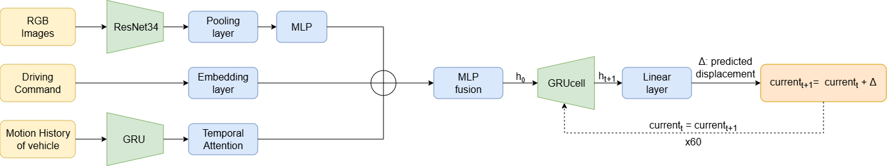

# CHAR — End-to-End Autonomous Driving Trajectory Prediction

## 1. Introduction

End-to-end planning for autonomous driving aims to directly map raw sensor inputs to driving decisions, removing the need for complex modular pipelines. This paradigm simplifies system design while enabling better adaptability and robustness in dynamic environments.

In this project, we implement an end-to-end deep learning model that predicts the **future trajectory of a self-driving vehicle** over 60 time steps. The model leverages visual input, high-level driving commands, and past motion history to generate accurate and temporally consistent trajectory predictions.

---

## 2. Project Objective

The goal of **CHAR** is to learn a function:

```
(camera image, driving command, motion history) -> future trajectory
```

More specifically:

* **Inputs:**
  * RGB image (current frame)
  * Driving command (`forward`, `left`, `right`)
  * Past trajectory (21 time steps)
* **Output:**
  * Future trajectory (60 time steps) in the vehicle's local coordinate frame

The model predicts **relative displacements (Δ)** autoregressively to improve stability and temporal consistency.

---

## 3. Dataset Overview

We use a subset of the **nuPlan dataset**, designed for large-scale autonomous driving planning tasks.

### Dataset Split

| Split      | Samples |
|------------|---------|
| Training   | 5,000   |
| Validation | 1,000   |
| Test       | —       |


> **Milestone 1 constraint:** Only `camera`, `driving_command`, and `sdc_history_feature` are allowed as inputs.

---

## 4. Data Preprocessing

### Image

* Normalized using ImageNet statistics:
  * `mean = [0.485, 0.456, 0.406]`
  * `std  = [0.229, 0.224, 0.225]`

### Motion History

* Original format: `[x, y, heading]`
* Heading decomposed into `(sin, cos)` for continuity
* Final shape:
  * Standard: `(21, 4)` -> `[x, y, sin(h), cos(h)]`

### Driving Command

* Encoded as integers:
  * `forward → 0`, `left → 1`, `right → 2`

### Data Augmentation

Applied with probability 0.5 during training:

* **Horizontal flip**: image flipped + `x → -x`, `sin(h) → -sin(h)` in history and future
* **Command swap**: `left ↔ right` when image is flipped
* **Gaussian noise**: σ = 0.05 added to history positions `(x, y)`
* **Color jitter**: brightness, contrast, saturation, hue

---

## 5. Model Architecture



### 5.1 Image Encoder

* Backbone: **ResNet-34** pretrained on ImageNet (all layers except the last 2)
* `AdaptiveAvgPool2d(1,1)` -> flatten -> `(B, 512)`
* MLP: `Linear(512 → 256) -> ReLU -> Dropout(0.2)`
* Output: `(B, 256)`

### 5.2 Command Encoder

* `nn.Embedding(3, 64)` - learned lookup table
* Output: `(B, 64)`

### 5.3 History Encoder

* `nn.GRU(input_size=4, hidden_size=256, num_layers=2, dropout=0.2)`
* **Temporal Attention** over the 21 GRU output states:
  * `Linear(256 -> 1) -> softmax -> weighted sum`
* Output: `(B, 256)`

### 5.4 Fusion Module

* Concatenation: `[image(256) | command(64) | history(256)]` → `(B, 576)`
* MLP: `Linear(576 -> 512) -> ReLU -> Dropout(0.2) -> Linear(512 -> 512) -> ReLU`
* Output hidden state: `(B, 512)`

### 5.5 Autoregressive Decoder

* `nn.GRUCell(input_size=3, hidden_size=512)` - single shared cell reused 60 times
* `nn.Linear(512 -> 3)` - output head predicting displacement

At each time step:

```
hₜ₊₁    = GRUCell(currentₜ, hₜ)
Δₜ      = Linear(hₜ₊₁)            → (Δx, Δy, Δheading)
currentₜ₊₁ = currentₜ + Δₜ        → accumulated absolute position
```

Repeated for **60 steps**, starting from the last known historical position.

---

## 6. Training Setup

| Hyperparameter     | Value                          |
|--------------------|--------------------------------|
| Optimizer          | AdamW                          |
| Learning rate      | 1e-3                           |
| Weight decay       | 1e-4                           |
| Scheduler          | CosineAnnealingLR (T_max=50)   |
| Batch size         | 32                             |
| Epochs             | 50                             |
| Gradient clipping  | norm = 1.0                     |
| Logging            | Weights & Biases               |

---

## 7. Loss Function

**Weighted L2 loss** on `(x, y)` positions only (heading excluded):

```
weights = linspace(1.0, 2.0, 60)    ← linearly increasing
loss    = mean( ‖pred[x,y] - target[x,y]‖₂ × weights )
```

Weights increasing from 1.0 to 2.0 encourage better long-term predictions.

---

## 8. Evaluation Metric & Results

### ADE (Average Displacement Error)

```
ADE = mean Euclidean distance between predicted and ground-truth (x, y)
```

* Lower is better
* Grading thresholds:
  * Full score: ADE < 2.0
  * Zero score: ADE > 4.0

### Results — Milestone 1

| Metric | Value |
|--------|-------|
| Val ADE | **1.70** |

---

## 9. Project Structure

```
Project/
├── src/
│   ├── model.py            # Model architecture (DrivingPlanner)
│   ├── train.py            # Training pipeline
│   ├── data_loader.py      # Dataset, preprocessing & augmentation
│   ├── eval.py             # Inference & submission generation
│   └── multimodal_loss.py  # Alternative loss (experimental)
├── data/                   # Dataset splits (train, val, test_public)
├── checkpoints/            # Saved model checkpoints
├── logs/                   # Training logs
├── Dockerfile
└── train.sh
```

---

## 10. How to Run

### Training

```bash
python src/train.py \
  --data_dir data \
  --ckpt_dir checkpoints \
  --epochs 50 \
  --batch_size 32 \
  --lr 1e-3 \
  --num_workers 4 \
  --augment_prob 0.5 \
  --wandb_mode online
```

### Inference / Submission

```bash
python src/eval.py
```

---

## 11. Key Design Choices

* **Multi-modal fusion**: combines vision, high-level command, and motion history in a shared latent space
* **Temporal attention**: lets the model focus on the most informative historical steps rather than treating all 21 equally
* **Shared GRUCell decoder**: a single cell reused 60 times enforces a consistent motion prior across the whole predicted trajectory
* **Delta prediction (Δ)**: predicting displacements rather than absolute positions improves stability and reduces error accumulation
* **Heading as (sin, cos)**: avoids angle discontinuities at ±π

---

## 12. Future Improvements

* Add depth or semantic segmentation inputs (next milestones)
* Replace GRU decoder with a Transformer-based decoder
* Incorporate map or lane information as additional context

---

## 14. Author

* Tomas Anderegg & Jules Streit 
* EPFL — Deep Learning for Autonomous Vehicles (DLAV)

---

