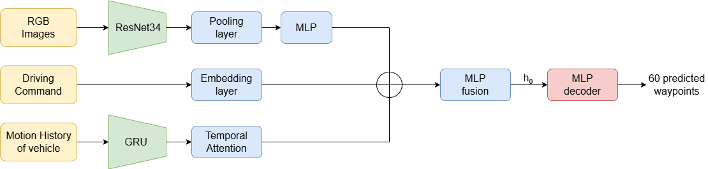
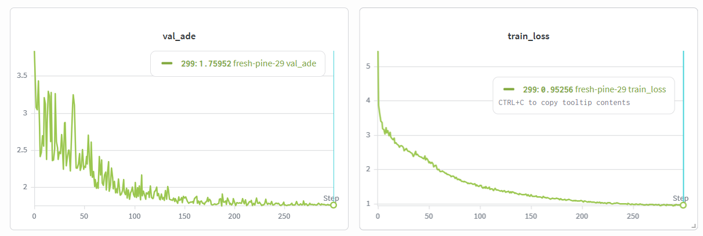

# CHAR — End-to-End Autonomous Driving Trajectory Prediction

## 1. Introduction

End-to-end planning for autonomous driving aims to directly map raw sensor inputs to driving decisions, removing the need for complex modular pipelines. This paradigm simplifies system design while enabling better adaptability and robustness in dynamic environments.

In this project, we implement an end-to-end deep learning model that predicts the **future trajectory of a self-driving vehicle** over 60 time steps. The model leverages visual input, high-level driving commands, and past motion history to generate accurate and temporally consistent trajectory predictions.

---

## 2. Project Objective

The goal of **CHAR** is to learn a function:

```
(camera image, driving command, motion history) -> future trajectory
```

More specifically:

* **Inputs:**
  * RGB image (current frame)
  * Driving command (`forward`, `left`, `right`)
  * Past trajectory (21 time steps)
* **Output:**
  * Future trajectory (60 time steps) in the vehicle's local coordinate frame

The model predicts **relative displacements (Δ)** autoregressively to improve stability and temporal consistency.

---

## 3. Dataset Overview

We use a subset of the **nuPlan dataset**, designed for large-scale autonomous driving planning tasks.

### Dataset Split

| Split      | Samples |
|------------|---------|
| Training   | 5,000   |
| Validation | 1,000   |
| Test       | —       |


> **Milestone 1 constraint:** Only `camera`, `driving_command`, and `sdc_history_feature` are allowed as inputs.

---

## 4. Data Preprocessing

### Image

* Normalized using ImageNet statistics:
  * `mean = [0.485, 0.456, 0.406]`
  * `std  = [0.229, 0.224, 0.225]`

### Motion History

* Original format: `[x, y, heading]`
* Heading decomposed into `(sin, cos)` for continuity
* Final shape:
  * Standard: `(21, 4)` -> `[x, y, sin(h), cos(h)]`

### Driving Command

* Encoded as integers:
  * `forward -> 0`, `left -> 1`, `right -> 2`

### Data Augmentation

Applied with probability 0.25 during training :

* **Horizontal flip**: image flipped + `x -> -x`, `sin(h) -> -sin(h)` in history and future
* **Command swap**: `left = right` when image is flipped
* **Gaussian noise**: σ = 0.05 added to history positions `(x, y)`
* **Color jitter**: brightness, contrast, saturation, hue

---

## 5. Model Architecture



### 5.1 Image Encoder -> `img_feat (B, 256)`
* **Backbone**: **ResNet-34** pre-trained on ImageNet, used to extract global visual features (all layers except the last two).
* **Global Pooling**: `AdaptiveAvgPool2d(1, 1)` followed by a flatten to obtain a vector of size 512.
* **Projection**: An MLP block consisting of `Linear(512 -> 256) + ReLU + Dropout(0.3)` to project the visual features into the fused latent space.

### 5.2 Command Encoder -> `cmd_feat (B, 64)`
* **Embedding**: An `nn.Embedding(3, 64)` layer maps the discrete command (`forward`, `left`, `right`) to a dense vector of dimension 64.

### 5.3 History Encoder -> `hist_feat (B, 256)`
* **Temporal Processing**: A **unidirectional 2-layer GRU** (`hidden_size=256`, `dropout=0.2`) processes the 21 timesteps of the vehicle's kinematic history.
* **Temporal Attention**: Rather than using only the last hidden state, an attention mechanism weights the 21 GRU output states:
  * `Linear(256 -> 1)` -> **Softmax** (over the temporal dimension) -> **Weighted sum** of states.
* This allows the model to focus on key moments in the past (e.g., a deceleration or the onset of a turn).

### 5.4 Fusion Module -> `latent_vector (B, 512)`
* **Concatenation**: The three modalities are fused: `[img_feat (256) | cmd_feat (64) | hist_feat (256)]` -> vector of size 576.
* **MLP Fusion**: A network `Linear(576 -> 512) -> ReLU -> Dropout(0.3) -> Linear(512 -> 512) -> ReLU`.
* **Output**: A 512-dimensional latent vector summarizing the current state and intent.

### 5.5 Non-Autoregressive Decoder
Unlike autoregressive approaches (step-by-step), the decoder predicts the entire trajectory in a single forward pass to avoid error accumulation and improve stability.

* **Direct Projection**: An MLP projects the latent vector to the full output dimension: `Linear(512 -> 180)`.
* **Reshaping**: The vector is reshaped into **(60, 3)**, representing the relative displacements $(\Delta x, \Delta y, \Delta \text{heading})$ for each timestep.
* **Trajectory Reconstruction**: The final trajectory is reconstructed via a cumulative sum (**cumsum**) from the last known position in the history:
  $$ \text{Pos}_{t} = \text{Pos}_{t-1} + \Delta_t $$

---

## 6. Training Setup

| Hyperparameter     | Value                          |
|--------------------|--------------------------------|
| Optimizer          | AdamW                          |
| Learning rate      | 1e-3                           |
| Weight decay       | 1e-4                           |
| Scheduler          | CosineAnnealingLR (T_max=50)   |
| Batch size         | 32                             |
| Epochs             | 300                            |
| Gradient clipping  | norm = 1.0                     |
| Logging            | Weights & Biases               |

---

## 7. Loss Function

**Unweighted ADE loss** on (x, y) positions only (heading excluded):

loss = mean( ‖pred[x,y] - target[x,y]‖₂ )

Directly optimizes the evaluation metric (Average Displacement Error).


---

## 8. Evaluation Metrics & Results

### 8.1 Training and Validation Metric: ADE
The **Average Displacement Error (ADE)** is the primary metric used to evaluate the global quality of the predicted trajectory in the ego-vehicle frame:

$$ ADE = \frac{1}{T} \sum_{t=1}^{60} \sqrt{(x_t - \hat{x}_t)^2 + (y_t - \hat{y}_t)^2} $$


### 8.2 Training Progress
The following plots illustrate the convergence of the model.



---

## 9. Project Structure

```
Project/
├── src/
│   ├── model.py            # Model architecture (CHARPlan)
│   ├── train.py            # Training pipeline
│   ├── data_loader.py      # Dataset, preprocessing & augmentation
│   ├── eval.py             # Inference & submission generation
│   └── multimodal_loss.py  # Alternative loss (experimental)
├── data/                   # Dataset splits (train, val, test_public)
├── checkpoints/            # Saved model checkpoints
├── submissions/            # Generated submission CSV files
├── logs/                   # Training logs
├── requirements.txt        # Python dependencies
└── train.sh                # SLURM training script

```

---

## 10. How to Run

### Training

```bash
python src/train.py \
  --data_dir data \
  --ckpt_dir checkpoints \
  --epochs 300 \
  --batch_size 32 \
  --lr 1e-3 \
  --num_workers 4 \
  --augment_prob 0.5 \
  --wandb_mode online
```

### Inference / Submission

```bash
python src/eval.py
```

---

## 11. Key Design Choices

- **Multi-modal fusion**: combines vision, high-level command, and motion 
  history in a shared latent space

- **Temporal attention**: lets the model focus on the most informative 
  historical steps rather than treating all 21 equally

- **Non-autoregressive MLP decoder**: predicts all 60 waypoints in a single 
  forward pass, avoiding the error accumulation of step-by-step autoregressive 
  decoding

- **Cumulative sum reconstruction**: predicting deltas (Δx, Δy, Δheading) 
  and accumulating them from the last known position enforces trajectory 
  continuity

- **Heading as (sin, cos)**: avoids angle discontinuities at ±π


---

## 12. Future Improvements

- Add depth or semantic segmentation inputs (next milestones)
- Replace the MLP decoder with a Transformer-based decoder for 
  better long-range dependency modeling
- Incorporate map or lane information as additional context
- Model ensembling: average predictions from multiple models 
  trained with different seeds to reduce variance
- Experiment with Huber loss (smooth L1) to reduce sensitivity 
  to outliers in trajectory prediction


---

## 14. Author

* Tomas  Garate Anderegg & Jules Streit 
* EPFL — Deep Learning for Autonomous Vehicles (DLAV)

---

